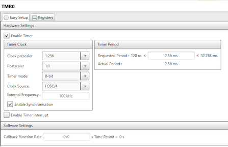
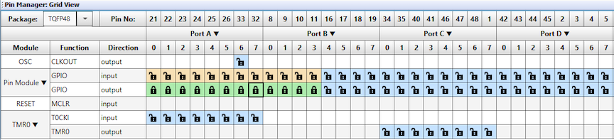

<a href="https://www.microchip.com" rel="nofollow"></a>

# Objective:
This project highlights the use of the PIC18-Q43 family’s new DMA peripheral to create a state machine which drives a common cathode 4 digit LED display application. A table in GPR data memory contains the display and digit drive values, the DMA peripheral transfers the data from the memory to PORTA and PORTB, and Timer0 (TMR0) triggers the DMA transfer. The table contains 8 values for 4 digits of display, the even number entries are the 7 segment drive, and the odd are the digit drives.

# Demo Configuration:
The Curiosity Nano Adapter Board (DM164150) is used in conjunction with the Curiosity Nano Base for Click Boards (AC164162), and a solder-less breadboard as the development platform. The Nano Base board has three MikroElektronika Click board slots, several types of power connections, voltage regulation circuitry, and a header mount for the Nano Development board. For this project the Nano Base board was used as a connection platform for connecting to the microcontroller via header pins.

### Curiosity Nano Development Board:


### Complete Project schematic:


### Complete Project Setup:


# Project Software Configuration:
The project software was developed in MPLAB X with the help of MPLAB Code Configurator (MCC) plug-in tool. MCC provides a user-friendly interface that generates software based on the user’s parameters. MCC allows developers who may not be familiar with a new peripheral a way to quickly set up and test a peripheral without having to dive deep into the device datasheet. For this project, MCC was used to generate code for the NCO and TMR0 modules.

## TMR0 Configuration:
The TMR0 module was configured such that the output frequency is 400Hz, which will generate a 100Hz update rate for the display.

### MCC TMR0 Editor Window:


```c
void TMR0_Initialize(void)
{
    // Set TMR0 to the options selected in the User Interface
    // T0CS FOSC/4; T0CKPS 1:256; T0ASYNC synchronised;
    T0CON1 = 0x48;
    // TMR0H 19;
    TMR0H = 0x13;
    // TMR0L 0;
    TMR0L = 0x00;
    // Clearing IF flag
    PIR3bits.TMR0IF = 0;
    // T0OUTPS 1:1; T0EN enabled; T016BIT 8-bit;
    T0CON0 = 0x80;
}
```

## PORTA and PORTB Configuration:
PORTA was configured as all output and initially low. PORTB was configured with bits 0-3 as outputs and initially low.

### MCC PORT Editor Window:


```c
void PIN_MANAGER_Initialize(void)
{
    /**
    LATx registers
    */
    LATA = 0x00;
    LATB = 0x00;
    /**
    TRISx registers
    */
    TRISA = 0x00;
    TRISB = 0xF0;
    /**
    ANSELx registers
    */
    ANSELB = 0xFF;
    ANSELA = 0xFF;
    /**
    WPUx registers
    */
    WPUB = 0x00;
    WPUA = 0x00;
    /**
    /**
    ODx registers
    */
    ODCONA = 0x00;
    ODCONB = 0x00;
    /**
    SLRCONx registers
    */
    SLRCONA = 0xFF;
    SLRCONB = 0xFF;
    /**
    INLVLx registers
    */
    INLVLA = 0xFF;
    INLVLB = 0xFF;
}
```

## DMA1 Configuration:
The DMA1 peripheral is used to transfer the wave data from the array in GPR data memory, to the LATA and LATB registers. The timing of the transfer is regulated by the roll over frequency of the TMR0 Additionally, the priority of DMA1 is set to the highest priority to minimize the latency time.

```c
void DMA1_Initialize(void)
{
    DMASELECT = 0;		    	// Select DMA1
    DMAnSSA = &buffer[0];   	//set source start address: display buffer
    DMAnDSA = 0x04BE;    		//set destination start address: LATA (LATB is 0x04BF)
    DMAnCON1 = 0x42; 	    	//set control register1: both source and destination increment
    DMAnSSZ = 0x0008; 	    	//set source size is 8 locations: buffer, 4 segment, 4 digit
    DMAnDSZ = 0x0002; 	    	//set destination size: PORTA and PORTB
    DMAnSIRQ = 0x1F; 		    //set DMA Transfer Trigger Source: TMR0 trigger
    DMAnAIRQ = 0x01; 		    //set DMA Transfer abort Source: none
    DMAnCON0 = 0xC0; 		    //set control register0: enable

	asm ("BANKSEL PRLOCK");	    // unlock priority setting register
    asm ("MOVLW 0x55");
    asm ("MOVWF PRLOCK");
    asm ("MOVLW 0xAA");
    asm ("MOVWF PRLOCK");
    asm ("BSF PRLOCK, 0");
	DMA1PR = 0;			        //set DMA1 to highest priority
}

```

## Display and 7 segment data table arrays:
The data table for display and 7 segment conversion are uint8_t arrays. The buffer array is preloaded with the appropriate digit drive values and a blank segment drive

```c
// 7 segment and buffer arrays
// BCD to 7 segment decoder array
unsigned char seven[11] = {0x3F, 0x06, 0x5B, 0x4F, 0x66, 0x6D, 0x7D, 0x07, 0x7F, 0x6F, 0x00};

// display buffer array {value1,digit1,value2,digit2,value3,digit3,value4,digit4}
unsigned char buffer[8] = {0x00, 0x01, 0x00, 0x02, 0x00, 0x04, 0x00, 0x08};

```

## System Configuration:
MCC can be used to configure basic system parameters, such as oscillator selection and other I/O pin configuration.
Once all project parameters have been configured, simply press the ‘Generate’ button, and MCC will generate the drivers based on user inputs.


# Conclusion:
This project uses the PIC18F57Q43 microcontroller’s TMR0, GPIOs, and DMA modules to create an automated 7-segment LED display driver that operates completely without firmware overhead. The state machine design is based on using the source address counter in the DMA as the state latch, increment the state machine from 0-7 and then rolling over. During each state, the DMA module transfers an appropriate value from the display buffer to the PORTs.
