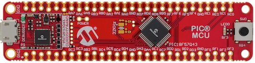
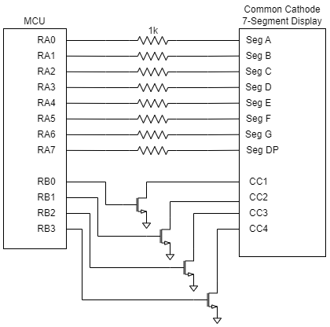
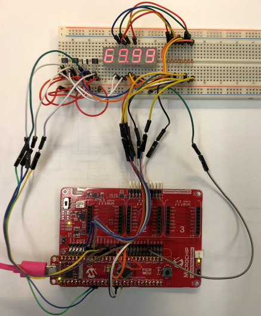

<a href="https://www.microchip.com" rel="nofollow"></a>

# Automated LED Display Driver Using PIC18-Q43 

## Introduction
This project highlights the use of the PIC18-Q43 family’s new Direct Memory Access (DMA) peripheral to create a state machine which drives a common cathode 4-digit LED display application. Using a table in General Purpose Registers (GPR) data which contains the display and digit drive values, the DMA peripheral transfers the data from the memory to PORTA and PORTB, and Timer0 (TMR0) triggers the DMA transfer. The table contains eight values for 4-digits of display, the even number entries are the 7-segment drive, and the odd are the digit drives.

#### Curiosity Nano Development Board:


## Software Used
- [MPLAB® X IDE 6.20](http://www.microchip.com/mplab/mplab-x-ide)
- [MPLAB® XC8 3.00 compiler or newer](http://www.microchip.com/mplab/compilers)
- [MPLAB® Code Configurator (MCC) 5.7.1](https://www.microchip.com/mplab/mplab-code-configurator)
- [Microchip PIC18F-Q Series Device Support 1.26.442](https://packs.download.microchip.com/)

## Hardware Used
- [PIC18F57Q43 Curiosity Nano Evaluation Kit (DM164150)](https://www.microchip.com/en-us/development-tool/DM164150)
- [Curiosity Nano Base for Click Boards&#x2122; (AC164162)](https://www.microchip.com/en-us/development-tool/ac164162)

## Demo Configuration
The Curiosity Nano Adapter board is used in conjunction with the Curiosity Nano Base for Click boards and a solderless breadboard as the development platform. The Nano Base board has three MikroElektronika Click board slots, several types of power connections, voltage regulation circuitry, and a header mount for the Nano Development board. For this project, the Nano Base board was used as a connection platform for connecting to the microcontroller via header pins.


### Complete Project Schematic


### Complete Project Setup


### Project Software Configuration
The project software was developed in MPLAB X with the help of the MPLAB Code Configurator (MCC) plug-in tool. MCC provides a user-friendly interface that generates software based on the user’s parameters, allowing developers to quickly set up a new peripheral without having to dive deep into the device data sheet. For this project, MCC was used to generate code for the DMA and TMR0 modules.

## TMR0 Configuration
TMR0 was configured to output a frequency of 400 Hz, which will generate a 100 Hz update rate for the display.

### TMR0 Settings
- Timer Enable: Enabled
- Timer Mode: 8-bit
- Clock Source: FOSC/4
- Synchronization Enable: Disabled
- Prescaler: 1:256
- Postscaler: 1:1
- Requested Period: 2.56 ms
- TMR Interrupt Enabled: Disabled

## PORTA and PORTB Configuration
PORTA was configured entirely as output and set to an initial low state. PORTB was configured with bits 0-3 as outputs and also set to an initial low state.

## DMA1 Configuration
The DMA1 peripheral is used to transfer the wave data from the array in GPR data memory to the LATA and LATB registers. The timing of the transfer is regulated by the roll over frequency of TMR0. Additionally, the priority of DMA1 is set to the highest priority to minimize the latency time.

### DMA1 Settings
- DMA Enable: Enabled 
- Start Trigger: TMR0
- Abort Trigger: None
- Source Region: GPR
- Source Variable: displayBuffer
- Source Size: 8
- Source Mode: Incremented
- Source Message Size: 8
- Source Counter Reload Action: SIRQEN is not cleared
- Destination Region: SFR
- Destination Module: ADCC (This value doesn't matter as the actual destination address will be set in software)
- Destination SFR: ADLTHL  (This value doesn't matter as the actual destination address will be set in software)  
- Destination Message Size: 2
- Destination Counter Reload Action: SIRQEN is not cleared


## Display and 7-segment Data Table Arrays
The data table for display and 7-segment conversion are uint8_t arrays. The buffer array is preloaded with the appropriate digit drive values and a blank segment drive.

```c
// 7 segment and buffer arrays
// BCD to 7 segment decoder array
unsigned char seven[11] = {0x3F, 0x06, 0x5B, 0x4F, 0x66, 0x6D, 0x7D, 0x07, 0x7F, 0x6F, 0x00};

// display buffer array {value1,digit1,value2,digit2,value3,digit3,value4,digit4}
unsigned char buffer[8] = {0x00, 0x01, 0x00, 0x02, 0x00, 0x04, 0x00, 0x08};

```

## System Configuration
MCC can be used to configure basic system parameters, such as oscillator selection and other I/O pin configuration.
Once all project parameters have been configured,  press the Generate button, and MCC will generate the drivers based on user inputs.


# Conclusion
This project uses the PIC18F57Q43 microcontroller’s TMR0, GPIOs and DMA modules to create an automated 7-segment LED display driver that operates completely without firmware overhead. The state machine design is based on using the source address counter in the DMA as the state latch, incrementing the state machine from 0-7 and then rolling over. During each state, the DMA module transfers an appropriate value from the display buffer to the PORTs.
